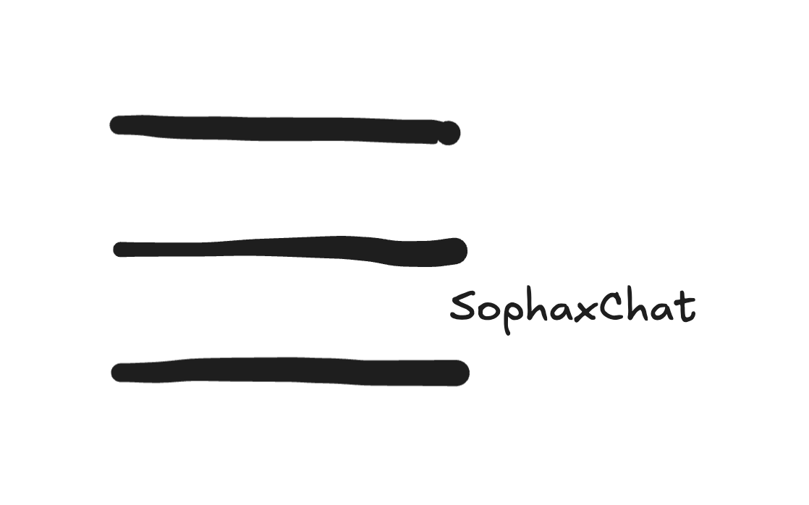

<div align="center">
  

  <h1>SophaxChat</h1>

  <p><strong>Signal-grade encryption. No servers. No accounts. No internet.</strong></p>

  <p>
    
    
    
    
    
  </p>

  <p>
    <a href="#protocol">Protocol</a> •
    <a href="#cryptography">Cryptography</a> •
    <a href="#architecture">Architecture</a> •
    <a href="#getting-started">Getting Started</a> •
    <a href="#security">Security</a> •
    <a href="#roadmap">Roadmap</a>
  </p>

  <br />

  > ⚠️ **Alpha — not yet production-ready.** Cryptographic primitives are sound, but the codebase has not been independently audited. Do not rely on it for life-critical anonymity.

</div>

---

## What is SophaxChat?

SophaxChat is an **open-source, infrastructure-free, end-to-end encrypted** iOS messenger. It works over Bluetooth LE and WiFi Direct — no internet required, no servers, no phone number, no account.

Every message is protected by the **Signal Protocol** (X3DH + Double Ratchet). Your identity is nothing more than a cryptographic key pair generated on your device.

### Why does it exist?

| Scenario | Signal | bitchat | SophaxChat |
|---|:---:|:---:|:---:|
| No internet connection | ❌ | ✅ | ✅ |
| No phone number required | ❌ | ✅ | ✅ |
| Signal-grade forward secrecy | ✅ | ❌ | ✅ |
| Per-session unique keys (X3DH) | ✅ | ❌ | ✅ |
| No server dependency | ❌ | ✅ | ✅ |
| Open-source (including server) | ⚠️ | ✅ | ✅ |
| Multihop relay (mesh routing) | ❌ | ✅ | ✅ |

SophaxChat occupies a specific niche: **Signal-grade cryptography, zero infrastructure**. Ideal for journalists, activists, protesters, disaster responders, or anyone in an environment where internet access is unavailable, monitored, or untrusted.

---

## Protocol

### Session Lifecycle

```
┌─ Alice ─────────────────────────────────────────────────────────── Bob ─┐

  [1. DISCOVERY — MultipeerConnectivity (Bluetooth LE / WiFi Direct)]

      Alice ←──── MPC peer found ────→ Bob

  [2. HELLO — Immediate key exchange on connection]

      Alice ──── Hello(PreKeyBundle_A) ────→ Bob
      Alice ←─── Hello(PreKeyBundle_B) ──── Bob

  [3. SESSION INIT — X3DH key agreement, first encrypted message]

      Alice computes:
        DH1 = DH(IK_A, SPK_B)
        DH2 = DH(EK_A, IK_B)
        DH3 = DH(EK_A, SPK_B)
        DH4 = DH(EK_A, OPK_B)  [if available]
        SK  = HKDF(DH1 || DH2 || DH3 || DH4)

      Alice ──── InitiateSession(EK_A, usedKeyIDs, DR_msg_0) ────→ Bob
                                                         Bob derives SK from his keys
                                                         Bob inits Double Ratchet

  [4. MESSAGES — Double Ratchet (forward secrecy + break-in recovery)]

      Alice ──── Message(DR_msg_1) ────→ Bob
      Alice ←─── Message(DR_msg_2) ──── Bob
           ...

  [5. RELAY — If Alice and Bob not directly connected]

      Alice ──── Relay(TTL=6, target=Bob, msg) ────→ Charlie ────→ Bob
                                                     (TTL=5)

└─────────────────────────────────────────────────────────────────────────┘
```

### Key Properties

- **Forward secrecy** — each message uses a unique message key derived via HMAC-SHA256. Compromising key `n` reveals nothing about keys `< n`.
- **Break-in recovery** — after a compromise, DH ratchet steps generate fresh key material from new Curve25519 ephemeral keys.
- **Multihop relay** — messages flood through the mesh with TTL=6, deduplicated via LRU cache. Alice can reach Bob through Charlie even without a direct link.
- **Offline queue** — messages queued in memory when no peers are reachable; drained automatically on reconnect.
- **Disappearing messages** — optional `expiresAt` timestamp; messages purged locally every 60 seconds.

---

## Cryptography

All primitives come from Apple's **[CryptoKit](https://developer.apple.com/documentation/cryptokit)** — hardware-accelerated and independently audited by Apple.

| Layer | Operation | Algorithm | Key Size |
|---|---|---|---|
| Identity | Signing | Ed25519 | 256-bit |
| Identity | Key agreement | X25519 | 256-bit |
| Session init | Key exchange | X3DH | — |
| Session init | Key derivation | HKDF-SHA256 | 256-bit |
| Messaging | Symmetric ratchet | HMAC-SHA256 | 256-bit |
| Messaging | DH ratchet | X25519 | 256-bit |
| Messaging | AEAD encryption | ChaCha20-Poly1305 | 256-bit |
| Storage | At-rest encryption | AES-256-GCM | 256-bit |
| Identity verification | Safety numbers | SHA-512 | — |

### Key Storage

All private keys and session states are stored in the **iOS Keychain** with `kSecAttrAccessibleWhenUnlockedThisDeviceOnly`:

- Not backed up to iCloud
- Not transferred to a new device
- Not accessible when the device is locked
- Wiped on device factory reset

---

## Architecture

```
SophaxChat/
├── Sources/SophaxChatCore/          # Core library — pure Swift, testable
│   ├── Crypto/
│   │   ├── CryptoTypes.swift        # Types, constants, error definitions
│   │   ├── KeychainManager.swift    # Keychain CRUD for all key material
│   │   ├── IdentityManager.swift    # Ed25519 + X25519 identity lifecycle
│   │   ├── PreKeyManager.swift      # X3DH prekey pool (SPK + 20 OTPKs)
│   │   ├── X3DH.swift              # X3DH sender and receiver implementation
│   │   └── DoubleRatchet.swift     # Double Ratchet (Signal spec)
│   ├── Network/
│   │   ├── NetworkProtocol.swift   # Wire message types + WireMessageBuilder
│   │   ├── MeshManager.swift       # MultipeerConnectivity P2P transport
│   │   └── RelayRouter.swift       # Multihop relay with LRU dedup cache
│   ├── Storage/
│   │   └── MessageStore.swift      # AES-256-GCM encrypted at-rest storage
│   └── ChatManager.swift           # High-level coordinator (session + routing)
│
├── SophaxChat/                      # iOS SwiftUI application
│   ├── App/
│   │   ├── SophaxChatApp.swift     # App entry point + blur-on-background
│   │   └── AppState.swift          # @MainActor observable state
│   └── Views/
│       ├── Onboarding/             # First-run username setup
│       ├── Chat/                   # Chat list, bubbles, relay indicator
│       └── Settings/               # Safety number verification
│
└── Tests/SophaxChatCoreTests/
    └── CryptoTests.swift           # X3DH symmetry + Double Ratchet correctness
```

### Data Flow

```
SwiftUI View
    │  sendMessage()
    ▼
ChatManager                  ← single coordinator, all state on main thread
    │
    ├─ buildOutboundWire()   ← X3DH init (new session) or DR encrypt (existing)
    │
    ├─ sendOrQueue()
    │       ├─ mesh.send()           if peer directly connected
    │       ├─ mesh.broadcast()      if peer reachable via relay (RelayEnvelope)
    │       └─ pendingQueue[]        if no connectivity (drained on reconnect)
    │
    └─ didReceiveMessage()
            ├─ .hello         → store PreKeyBundle, drain pending queue
            ├─ .initiateSession → X3DH receiver, DR init, decrypt first msg
            ├─ .message       → DR decrypt, send ACK
            ├─ .ack           → update message status
            └─ .relay         → if for me: process inner; if not: forward (TTL-1)
```

---

## Getting Started

### Requirements

| Requirement | Version |
|---|---|
| Xcode | 15.0+ |
| iOS deployment target | 17.0+ |
| Physical devices | 2× iPhone (MultipeerConnectivity requires real hardware) |
| XcodeGen | latest |

> **Note:** The Swift core library (`SophaxChatCore`) builds without Xcode via `swift build`. Physical devices are only required to test P2P connectivity.

### Build

```sh
# 1. Clone
git clone https://github.com/sophaxtechnologies/SophaxChat.git
cd SophaxChat

# 2. Install XcodeGen
brew install xcodegen

# 3. Generate Xcode project
xcodegen generate

# 4. Open in Xcode
open SophaxChat.xcodeproj
```

Then in Xcode:
1. Select your development **Team** in the project settings (Signing & Capabilities)
2. Choose a physical device as the build target
3. **⌘R** to build and run

Repeat on the second device.

### Verify the core library (no Xcode needed)

```sh
swift build
```

### Tests

```sh
# Run in Xcode (Swift Testing framework)
# Product → Test  (⌘U)
```

Tests cover: X3DH key symmetry (with/without OTPK), Double Ratchet bidirectional messaging, out-of-order message delivery, session state persistence, associated data binding, and KDF distinctness.

---

## Security

### What SophaxChat protects against

| Threat | Protection |
|---|---|
| Network eavesdropping | ChaCha20-Poly1305 E2EE; transport also encrypted (MPC `.required`) |
| MITM / impersonation | Ed25519 signatures on every message; Safety Number verification |
| Replay attacks | Unique nonce per message; message-ID deduplication at storage layer |
| Past message compromise | Forward secrecy via symmetric ratchet (per-message keys) |
| Future message compromise | Break-in recovery via DH ratchet (fresh Curve25519 ephemeral keys) |
| Session eavesdropping by relay | Inner message E2EE; relay nodes see envelope metadata only |
| Data at rest | AES-256-GCM per-conversation encrypted files |
| iCloud backup exfiltration | `kSecAttrAccessibleWhenUnlockedThisDeviceOnly`; backup excluded |
| App Switcher screenshot | App content blurred on `UIApplication.willResignActiveNotification` |
| DoS via oversized messages | Input validation: message ≤ 64 KB, username ≤ 64 chars |
| Prekey exhaustion | OTPK pool auto-replenished when below 50%; SPK rotated every 7 days |

### Identity verification

Each user has a **Safety Number** — a 60-digit fingerprint derived from SHA-512 of their own identity keys, displayed as 12 groups of 5 digits. Both numbers are shown side by side in the verification screen: each party reads their own number aloud to the other. If both match on both devices, the connection is authentic.

### Known limitations (MVP)

These are architectural limitations that will be addressed in future releases:

| Limitation | Impact | Roadmap |
|---|---|---|
| No header encryption | Ratchet headers (key rotation events, message count) visible to relay nodes | v0.4 |
| No sealed sender | Sender peerID visible in wire envelope | v0.5 |
| No group messaging | 1:1 sessions only | v0.6 |
| No store-and-forward | Offline recipients miss messages (unless relayed via intermediate peer) | v0.6 |
| No independent audit | See responsible disclosure below | Planned |

### Responsible Disclosure

Do not open public issues for security bugs.

---

## Roadmap

### v0.2 — Current
- [x] X3DH session establishment
- [x] Double Ratchet messaging
- [x] Multihop relay (TTL flooding + LRU dedup)
- [x] Offline message queue
- [x] Disappearing messages (per-message expiry, 30s–7d, UI toggle in chat)
- [x] SPK rotation (7-day automatic)
- [x] OTPK replenishment
- [x] Safety Numbers
- [x] Relay hop indicator in UI

### v0.3 — Short-term
- [x] QR code Safety Number scanner
- [ ] Push-to-talk (voice messages, encrypted)
- [ ] Image sharing (encrypted, ephemeral)
- [x] Unread message badges
- [x] Delete conversation + block peer

### v0.4 — Security hardening
- [ ] **Header encryption** (Double Ratchet extension — hides metadata)
- [ ] **Sealed sender** (hides sender identity from relay nodes)
- [x] Rate limiting on relay forwarding (20 relays / 10s per peer)
- [x] Per-peer session initiation deduplication

### v0.5 — Platform
- [ ] macOS support (Catalyst / native AppKit)
- [ ] Background operation (BLE central/peripheral mode)
- [ ] Custom MCSession transport adapter (pluggable: LoRa, audio covert channel)

### v0.6 — Group messaging
- [ ] Group sessions (Sender Keys protocol or MLS)
- [ ] Channel discovery (broadcast announcements)

### Long-term
- [ ] Independent third-party security audit (NLnet / NGI grant target)
- [ ] Hardware security key support (FIDO2 / Secure Enclave binding)

---

## Contributing

Pull requests are welcome. Before contributing:

1. Read [SECURITY.md](SECURITY.md) — especially if touching crypto code
2. Open an issue to discuss significant changes before writing code
3. All cryptographic changes require a corresponding test in `CryptoTests.swift`
4. Run `swift build` before submitting

### Areas where help is especially welcome

- **UI/UX** — the interface is functional, not polished
- **Tests** — relay dedup, session initiation edge cases, offline queue
- **macOS port** — Catalyst bridge
- **Localization** — the app currently ships in English only

---

## License

MIT — see [LICENSE](LICENSE).

```
Copyright (c) 2025 Sophax Technologies

Permission is hereby granted, free of charge, to any person obtaining a copy
of this software and associated documentation files (the "Software"), to deal
in the Software without restriction, including without limitation the rights
to use, copy, modify, merge, publish, distribute, sublicense, and/or sell
copies of the Software, and to permit persons to whom the Software is
furnished to do so, subject to the following conditions:

The above copyright notice and this permission notice shall be included in all
copies or substantial portions of the Software.
```

---

<div align="center">
  <sub>Built with ❤️ and paranoia. No servers were harmed in the making of this app.</sub>
</div>
